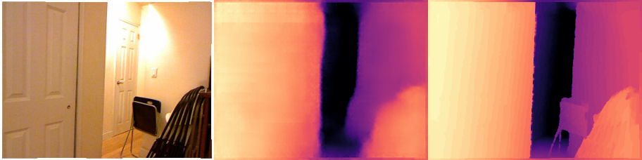
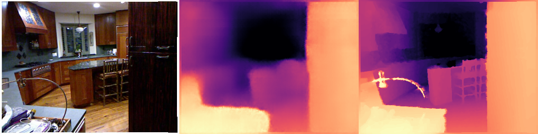
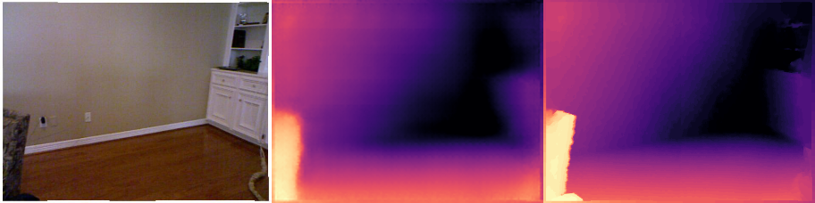
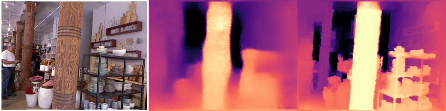

# FCRN_PyTorch
PyTorch Implementation of paper "Deeper Depth Prediction with Fully Convolutional Residual Networks"

## Introduction

This is an original implementation of [Deeper Depth Prediction with Fully Convolutional Residual Networks](http://ieeexplore.ieee.org/document/7785097/) based on PyTorch (1.9.1). This paper addresses the problem of estimating the depth map of a scene given a single RGB image using a fully convolutional architecture.

## Tested Environment

- Ubuntu 20.04
- torch 1.9.1+cu111
- numpy 1.21.2

## Results

After 25 epochs of training:

## Files

- train.py : model training
- predict.py: result visualization
- utils/trainOptions.py: training settings

## Reference

https://github.com/iro-cp/FCRN-DepthPrediction

https://github.com/dontLoveBugs/FCRN_pytorch

https://github.com/XPFly1989/FCRN
